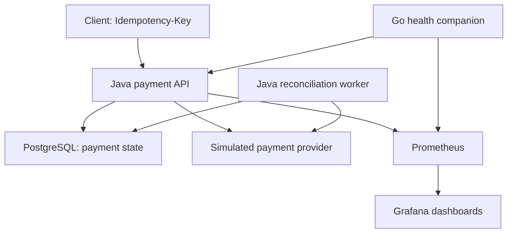

# PayGuard

PayGuard is a local-first payment reliability portfolio built with Java, Go, Python, and a DevOps/SRE stack. It demonstrates how to handle a provider timeout **after a simulated charge** without creating a second payment: record `UNKNOWN`, return the same payment ID on retry, and reconcile to `SUCCESS`.

The provider is a simulation. No real money is charged, and the local stack requires no cloud account.

**[Portfolio](https://chandanvura.github.io/PayGuard/) · [Interactive replay](https://chandanvura.github.io/PayGuard/dashboard.html) · [Timestamped monitoring evidence](https://chandanvura.github.io/PayGuard/observability/latest/prometheus.html) · [Test evidence](docs/VALIDATION.md) · [Windows start/stop guide](docs/WINDOWS-OPERATIONS.md)**

## What is implemented

| Area | Implementation and scope |
|---|---|
| Payment API | Java 21, Spring Boot, Maven Wrapper, PostgreSQL 17, Flyway migrations, JPA schema validation |
| Reliability | Idempotency, concurrent-request integration tests, simulated provider failures, bounded reconciliation with attempt metadata |
| Go companion | Standard-library health observer; checks the Java API every five seconds; exposes health and probe metrics |
| Python automation | Payment/reconciliation demo, Go companion checks, Prometheus evidence export |
| Containers | Docker Compose; Java and Go images; localhost host bindings |
| Kubernetes | API pod with Java and Go containers, PostgreSQL PVC, probes, resource requests/limits; Minikube configuration and temporary kind CI tests |
| Observability | Micrometer → Prometheus → Grafana; container logs → Alloy → Loki → Grafana |
| SRE | Availability and latency SLIs, recording rules, error-budget burn-rate and latency alert rules |
| CI | GitHub Actions: Java tests, Go race tests/vet, image builds, PowerShell parsing, manifest validation, live infrastructure checks |
| Jenkins | Windows Jenkinsfile: Java tests/package, both Docker image builds, Kubernetes dry-run validation, JUnit/artifacts; execution pending |
| Terraform | Isolated `payguard-iac` namespace and ConfigMap; apply/idempotency tested; does not deploy application workloads |
| Ansible | Operational verification of nodes, namespace, rollouts, PVC, and pods; does not deploy the platform |

## Architecture and payment flow



A normal request becomes `SUCCESS`. For the timeout scenario, the provider records success and then throws; the API stores `UNKNOWN`. Retrying with the same key returns the same payment ID. The reconciliation worker checks the provider and updates the stored result. Flyway owns schema changes through migrations V1–V3; JPA validates the schema.

The Go companion shares the Java container's network namespace in Compose and its pod network in Kubernetes. Its counters reset on restart. It observes health; reconciliation stays in Java, and container/pod restarts belong to Compose/Kubernetes.

## Run locally on Windows

Use **PowerShell**, with Docker Desktop running. A PowerShell prompt begins with `PS`; from Command Prompt, enter `powershell -NoProfile`. Git and Docker are required for Compose; Docker builds Java and Go, so separate local Java/Go installs are unnecessary for this path.

For a fresh clone and `.env` setup, follow [Windows operations](docs/WINDOWS-OPERATIONS.md). That guide also covers your actual nested checkout and recovery when a database volume survives deletion of the project folder. **Keep the existing `.env` when reusing a database volume.** Generating a different password does not change the password stored in PostgreSQL.

From the directory containing `docker-compose.yml`:

```powershell
.\scripts\start.ps1
.\scripts\status.ps1
.\scripts\run-demo.ps1
```

The start script generates a Grafana password in the ignored `.env` if missing and builds absent images. The demo waits for API startup and verifies payment success, timeout, same-ID retry, reconciliation, Go health/metrics, both Prometheus targets, SLI/SLO rules, Loki, and Grafana.

| Local service | Address |
|---|---|
| API health | <http://localhost:8081/actuator/health> |
| Go companion health | <http://localhost:9101/healthz> |
| Go metrics | <http://localhost:9101/metrics> |
| Grafana | <http://localhost:3000> |
| Prometheus | <http://localhost:9090> |
| Loki readiness | <http://localhost:3100/ready> |
| PostgreSQL | `localhost:15432` (container port `5432`) |

Stop Compose while keeping an existing Minikube cluster running:

```powershell
.\scripts\stop.ps1 -KeepMinikube
```

To stop Compose **and Minikube**, run `.\scripts\stop.ps1`. Both retain database volumes. Do not use `docker compose down -v` when you want to keep data.

Return later from the same directory:

```powershell
git pull --ff-only
.\scripts\start.ps1
.\scripts\run-demo.ps1
```

The start script builds only absent images. After pulling changes to application code or Dockerfiles, rebuild existing images before starting:

```powershell
docker build -t payguard-payment-service:local .\payment-service
docker build -t payguard-sidecar:local .\sidecar
.\scripts\start.ps1
```

## Portfolio and hosted monitoring

GitHub Pages hosts the [architecture](https://chandanvura.github.io/PayGuard/architecture.html), [learning guide](https://chandanvura.github.io/PayGuard/learning.html), [monitoring explanation](https://chandanvura.github.io/PayGuard/monitoring.html), and [demo instructions](https://chandanvura.github.io/PayGuard/demo.html).

The hosted workflow temporarily starts the real API, PostgreSQL, Go companion, Prometheus, Loki, and Grafana; checks payment recovery; exports Prometheus results; captures Grafana; and deploys static evidence. It runs daily and on relevant changes/manual dispatch. The site remains accessible without your laptop, but its monitoring output is a **dated capture**, not a permanent public payment API or monitoring server.

[Grafana Cloud forwarding](docs/GRAFANA-CLOUD.md) is optional, requires your own account/token, and is not needed for the portfolio. No configured Grafana Cloud deployment is claimed.

## Tests and verification

The application/test commit `0befc2a` passed on **8 October 2026**:

| Evidence | What actually ran |
|---|---|
| [CI](https://github.com/chandanvura/PayGuard/actions/runs/37754273510) | Java tests with PostgreSQL, Go behavior tests with race detection and vet, both image builds, PowerShell syntax parsing, Kubernetes schema validation |
| [Infrastructure runtime](https://github.com/chandanvura/PayGuard/actions/runs/37754273454) | Real manifests in kind; both containers ready; payment/reconciliation demo; pod replacement and retained payment; Terraform apply/no-change plan; Ansible playbook |
| [Hosted monitoring](https://github.com/chandanvura/PayGuard/actions/runs/37754273530) | Compose payment/Go checks, Prometheus export, Grafana capture, Pages deployment |

The Windows Compose demo also passed locally on 28 September 2026. See [validation details and limits](docs/VALIDATION.md). A kind run verifies the repository manifests on that cluster; it does not verify your exact Minikube installation.

Run Java tests locally with Java 21 and the database running (set `DB_URL`, `DB_USERNAME`, and `DB_PASSWORD` to match your local `.env`; the host database port is `15432`):

```powershell
cd .\payment-service
.\mvnw.cmd --batch-mode clean test
cd ..
```

With Go installed, run companion tests from the repository root:

```powershell
cd .\sidecar
go test -race ./...
go vet ./...
cd ..
```

Race testing requires a supported compiler toolchain, including a C compiler. Go tests cover unhealthy startup, failure/recovery, timeout, invalid target, metrics counters, and HTTP methods/routes. Python `scripts/ci-demo.py` and `scripts/check-sidecar.py` exercise running services; they require reachable API/companion endpoints.

## CI and infrastructure operations

| Workflow | Purpose |
|---|---|
| [ci.yml](.github/workflows/ci.yml) | Java/Go checks, Docker builds, PowerShell parsing, manifest validation |
| [reliability-demo.yml](.github/workflows/reliability-demo.yml) | Temporary PostgreSQL + Java reliability scenario and evidence artifact |
| [runtime-validation.yml](.github/workflows/runtime-validation.yml) | Temporary kind deployment, replacement/persistence, Terraform, Ansible |
| [hosted-monitoring.yml](.github/workflows/hosted-monitoring.yml) | Temporary Compose monitoring and Pages deployment |

The [Jenkinsfile](Jenkinsfile) requires a configured Windows Jenkins agent with Java 21, Git, Docker, kubectl, a running PostgreSQL database on host port `15432`, and a username/password credential named `payguard-db-credentials`. GitHub Actions success does not establish Jenkins execution.

## Kubernetes

`start.ps1 -Kubernetes` starts Minikube but **does not deploy the manifests or load images**. Deploy both images and local secrets before using `run-demo.ps1 -Kubernetes`; consult the [operations runbook](docs/runbooks/OPERATIONS.md) and [architecture guide](docs/ARCHITECTURE.md). The kind workflow contains a complete automated deployment example. It creates an ephemeral database secret instead of using the example password.

## Terraform and Ansible

Terraform commands run from `terraform/` with a reachable cluster/kubeconfig. The default context is `minikube`; CI overrides it to `kind-payguard-test`. The Ansible playbook runs from `ansible/` on Linux/WSL with access to the relevant kubeconfig. Their verified scope is namespace/configuration management and operational verification, respectively.

## Secrets and Repository Safety

Compose host ports bind to `127.0.0.1`. Keep `.env`, real Kubernetes secrets, tokens, private keys, kubeconfig, and Terraform state out of Git. `kubernetes/secret.example.yaml` is an example; `kubernetes/secret.yaml` is ignored. These are useful safeguards, not evidence of a full security audit.

An existing Grafana volume may retain its old password even after `.env` changes. To rotate the admin password after starting:

```powershell
$grafanaPassword = (Get-Content .env | Where-Object { $_ -match '^GRAFANA_ADMIN_PASSWORD=' } | Select-Object -Last 1) -replace '^GRAFANA_ADMIN_PASSWORD=', ''
docker compose exec -T grafana grafana cli admin reset-admin-password $grafanaPassword
Remove-Variable grafanaPassword
```

Remaining limits: Jenkins runtime execution, the exact local Minikube configuration, dedicated vulnerability/secret-scanning pipelines, and load/resource-budget testing. Kubernetes manifests specify resource requests/limits; Compose does not yet enforce a memory budget. Several observability images use `latest`, so future pulls may change their versions. Prometheus alert rules are present; external alert delivery is not established by the tests.

## Repository and documentation

| Directory/file | Contents |
|---|---|
| `payment-service/` | Java API, migrations, integration tests, Dockerfile |
| `sidecar/` | Go health observer, behavior tests, Dockerfile |
| `scripts/` | Windows operations and Python/JavaScript hosted automation |
| `kubernetes/` | API/companion, PostgreSQL, PVC, config and secret example |
| `observability/` | Prometheus/rules, Grafana provisioning/dashboards, Loki/Alloy |
| `terraform/`, `ansible/` | Infrastructure representation and operational verification |
| `.github/workflows/`, `Jenkinsfile` | CI and runtime validation |
| `website/` | Static portfolio and interactive replay |
| `docs/` | Detailed guides, runbooks and verification scope |

- [Windows start/stop and credential recovery](docs/WINDOWS-OPERATIONS.md)
- [Validation evidence](docs/VALIDATION.md)
- [Architecture](docs/ARCHITECTURE.md)
- [SRE design](docs/SRE.md)
- [CI/CD guide](docs/CI-CD.md)
- [Operations runbook](docs/runbooks/OPERATIONS.md)
- [Optional Grafana Cloud](docs/GRAFANA-CLOUD.md)

PayGuard is intended to demonstrate tested engineering decisions around payment uncertainty, persistence, monitoring, deployment, and recovery. The simulated provider and temporary runner evidence define the scope of those claims.
